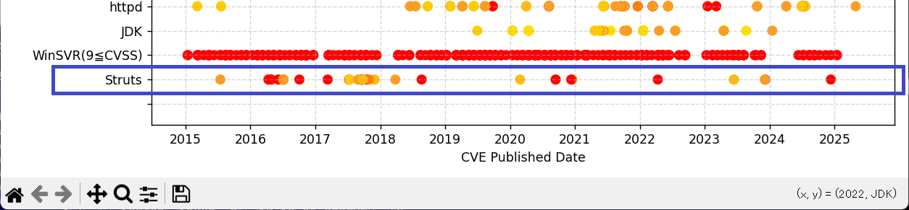

# OSSVulHeatMap.py
OSSVulHeatMap.pyは、OSSのCVE/CVSSデータを表示するPythonプログラムです。CVEDetails.comのサイトからコピーしたCVEデータをテキストに保存したものを、matplotlib.pyplotを利用して下図のように表示することができます。


縦軸はOSS、OS、Library名、横軸は西暦、プロットされている点はCVEが発行された日でCVSSのレベル(0-10)に合わせて色分けしています。これによりどのOSSがどの程度の頻度でどれほどのリスクの脆弱性が発覚しているかを一覧することができます。

### 動作環境
このプログラムは以下の環境で動作することを確認しています。
- Windows 11 Pro Version 24H2. Build 26100.4652
- python version 3.13.2

またOSSVulHeatMap.pyは外部ライブラリーとして以下を利用しています。
- pandas
- matplotlib
- mplcursors
上記ライブラリーをインストールしていない場合は

```bash
pip install -r requirements.txt
```

を実行してインストールすることができます。


### 実行方法
OSSVulHeatMap.py, CVEFilesフォルダーと配下のデータをダウンロードします。
以下のコマンドを実行してOSSの脆弱性HeatMapを表示することができます。

```bash
python OSSVulHeatMap.py
```

このサンプルでは、以下のOSS
- Apache Web Server(httpd)
- Apache Tomcat
- Apache Solr

とそれらが利用しているOSS。

- OpenJDK
- Windows Server

の過去10年分ののCVEデータを取得、表示しています。

### 新規のデータの取得、追加、表示方法
- https://www.cvedetails.com/ をブラウザで開きます。
- 参照したいOSS、ライブラリー名で検索します。

以下Apache StrutsのCVEファイルの作成例を示します。<br>
- Apache StrutsのCVEのページをブラウザで開きます。<br>
- https://www.cvedetails.com/vulnerability-list/vendor_id-45/product_id-6117/Apache-Struts.html

- ページ内右上の「Copy」ボタンをクリックします。
- エディターでテキストファイルを開きペーストします。
- ファイルをUTF8フォーマットでCVEFilesフォルダー下に保存します。
- さらにページがある場合は[>]ボタンを押して次のページを開き、同様に「Copy」してファ イルにペースト、保存します。
- これらのファイルの名前を仮に Struts_01.txt, Struts_02.txtとします。

- OSSVulHeatMap.py 65行目の file_list配列としてデータを追加します。
- 以下の2行を追加します。

```python
@dataclass
class OssCVEFiles:
    name_oss:   str
    name_file:  str

file_list = [
    OssCVEFiles('Strut',    'Strut_01.txt'),
    OssCVEFiles('Strut',    'Strut_02.txt'),
      :
    OssCVEFiles('WinSVR(9≦CVSS)',       'CVE_WinSVR2019_CVSS9_01.txt'),  
      :
```

以下のコマンドを実行すると、Strutsが追加された図が表示されます。


```bash
python OSSVulHeatMap.py
```




## ライセンス
OSSVulHeatMap.pyはMITライセンスのものと公開されている、完全なオープンソースソフトウェアです。<br>

本プログラムは、Common Vulnerabilities and Exposures（CVE®）リストのデータを利用しています。
本データは MITRE Corporation によって提供されており、CVE 利用規約に基づいて使用されています。
利用規約の詳細については以下をご参照ください：
https://www.cve.org/Legal/TermsOfUse


