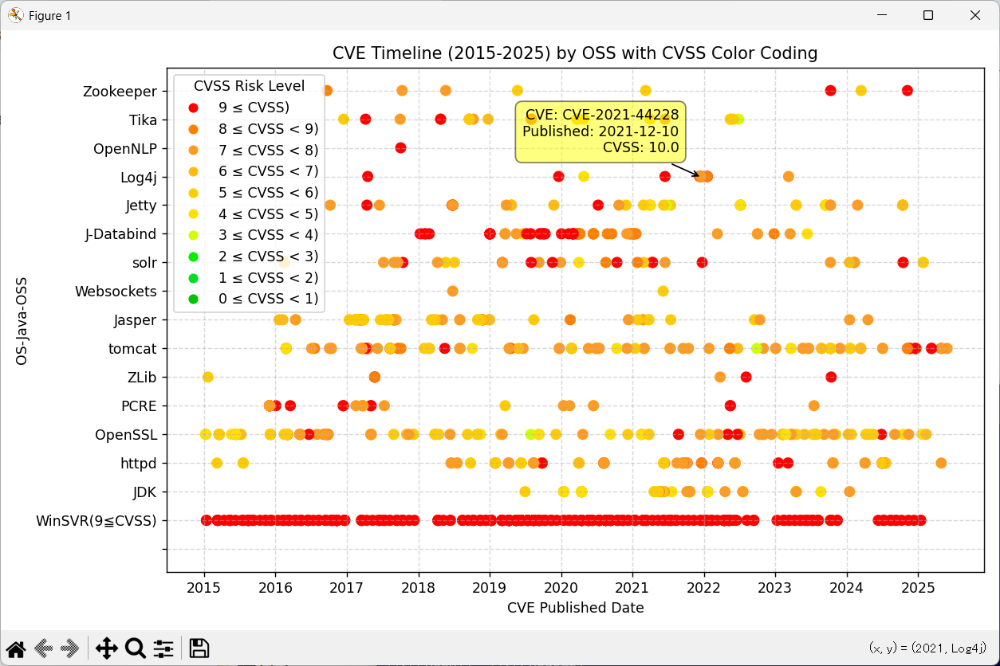

# IISECRep01
OSSのCVE/CVSSデータを表示するPythonプログラムです。CVEDetails.comのサイトからコピーしたCVEデータをテキストに保存したものを、matplotlib.pyplotを利用して下図のように表示することができます。

縦軸はOSS、OS、Library名、横軸は西暦、プロットされている点はCVEが発行された日でCVSSのレベル(0-10)に合わせて色分けしています。これによりどのOSSがどの程度の頻度でどれほどのリスクの脆弱性が発覚しているかを一覧することができます。

本ソースコードに含まれているCVEのデータ(CVEFilesフォルダー下)は
Apache Web Server(httpd)
Apache Tomcat
Apache Solr
とそれらが利用しているメジャーなOSS、OpenJDK, Windows Serverの過去10年分ののCVEデータを取得、表示しています。

実行方法
OSSVulHeatmap.py, CVEFilesフォルダーと配下のデータをダウンロードします。
以下のコマンドを実行して表示することができます。
python OSSVulHeatmap.py

新規のデータの取得、追加、表示方法
https://www.cvedetails.com/ をブラウザで開きます。
参照したいOSS、ライブラリー名で検索します。

以下Apache StrutsのCVEファイルの作成例を示します。
Apache StrutsのCVEのページをブラウザで開きます。
https://www.cvedetails.com/vulnerability-list/vendor_id-45/product_id-6117/Apache-Struts.html

ページ内右上の「Copy」ボタンをクリックします。
エディターでテキストファイルを開きペーストします。
ファイルをUTF8フォーマットでCVEFilesフォルダー下に保存します。
さらにページがある場合は[>]ボタンを押して次のページを開き、同様に「Copy」してファイルにペースト、保存します。
これらのファイルの名前を仮に Struts_01.txt, Struts_02.txtとします。

OSSVulHeatMap.py 65行目の file_list配列としてデータを追加します。
以下の2行を追加します。
@dataclass
class OssCVEFiles:
    name_oss:   str
    name_file:  str

file_list = [
    OssCVEFiles('Strut',    'Strut_01.txt'),
    OssCVEFiles('Strut',    'Strut_02.txt'),
      :
    OssCVEFiles('WinSVR(9≦CVSS)',       'CVE_WinSVR2019_CVSS9_01.txt'),  
      :

python OSSVulHeatMap.py
を実行すると Strutsが追加された図が表示されます。

